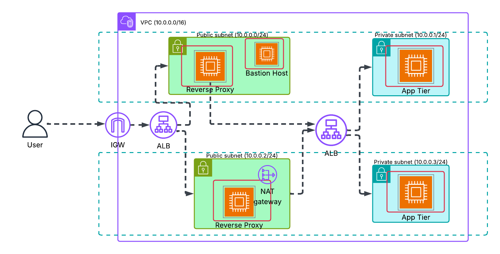

# 🚀 Scalable 2-Tier Web Architecture on AWS with Terraform

This project sets up a scalable and modular 2-tier web application architecture on AWS using Terraform. It includes reverse proxies in public subnets and backend web servers in private subnets. Load balancers distribute traffic, and a Bastion Host enables secure SSH access to private instances.

---

## 📌 Architecture Overview



### 🧱 Infrastructure Components

- **VPC (CIDR: 10.0.0.0/16)**
  - 2 Public Subnets:
    - EC2 Instances with **Nginx Reverse Proxy**
    - NAT Gateway
    - Bastion Host
  - 2 Private Subnets:
    - EC2 Instances for **Backend Applications** (e.g., Flask/Node.js)
  - **Internet Gateway** for public traffic
  - **NAT Gateway** for private subnet internet access
  - **Public ALB**: Routes user traffic to Reverse Proxies
  - **Internal ALB**: Routes internal traffic from proxies to backend EC2 instances

---

## ⚙️ Terraform Setup

### Workspace

- **Custom Workspace**: `dev` (do not use default)

### Remote State

- Terraform state is stored remotely in an **S3 bucket** for collaboration and safety.

### Modules

All infrastructure is split into reusable **custom modules**, each containing:
- `main.tf`
- `variables.tf`
- `outputs.tf`

Modules include:
- VPC
- Subnets
- Internet Gateway & NAT Gateway
- Security Groups
- EC2 Instances (Reverse Proxy, App Backend, Bastion)
- ALBs

---

## 🔧 Provisioning & Configuration

- **Remote Provisioner**:
  - Installs Apache or Nginx on EC2 instances.
- **File Provisioner**:
  - Copies web application backend files from your local machine to **private** EC2s.
- **Local Exec**:
  - Writes all EC2 IPs into a file named `all-ips.txt`:
    ```text
    public-ip1 1.1.1.1
    public-ip2 2.2.2.2
    ...
    ```
- **Data Source**:
  - Fetches the latest **Amazon Linux 2 AMI** dynamically for EC2 instances.

---

## 🔐 Access & Security

- **Bastion Host**:
  - Deployed in a public subnet
  - SSH access to private EC2s via the bastion (no direct public access to app servers)
- **Security Groups**:
  - Fine-grained control for each component (ALB, EC2, Bastion, etc.)

---

## 🏁 Usage

### 1. Initialize Terraform
  - terraform init
### 2. Select/Create Workspace
  - terraform workspace new dev
  - terraform workspace select dev
### 3. Apply Infrastructure
  - terraform apply
---

## Notes
  - Make sure your local machine has SSH access to EC2 instances via the bastion.
  - Ensure your backend files are available locally to be copied via the file provisioner.
